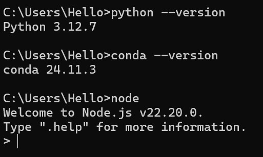
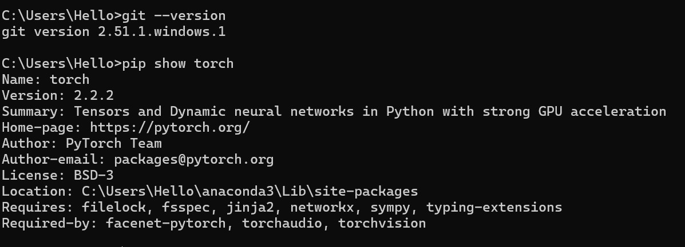

# Week 1

---

## 2. Questions and Answers

### Q1. What is the difference between Python and Anaconda?
**A:** Python is a programming language. Anaconda is a Python distribution that comes with many libraries and tools preinstalled.

### Q2. Why do we install Node.js for this course?
**A:** Node.js allows us to run JavaScript outside the browser and helps with web-based data visualization or app deployment.

### Q3. What is PyTorch used for?
**A:** PyTorch (深度学习框架) is used for building and training neural networks in AI and machine learning.

---

